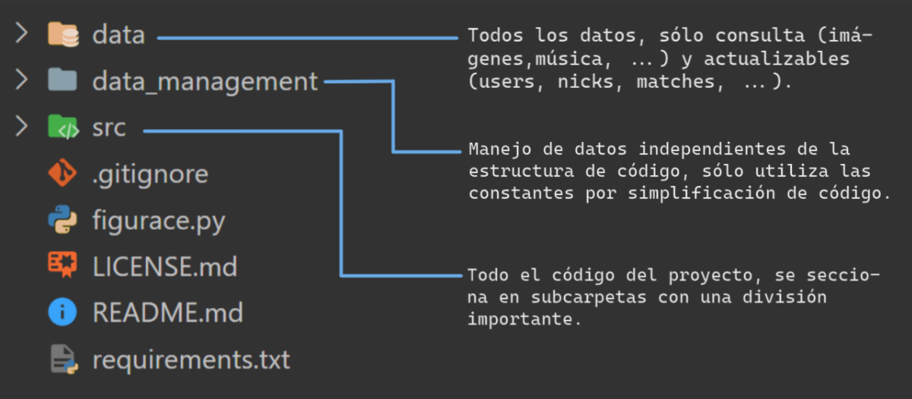
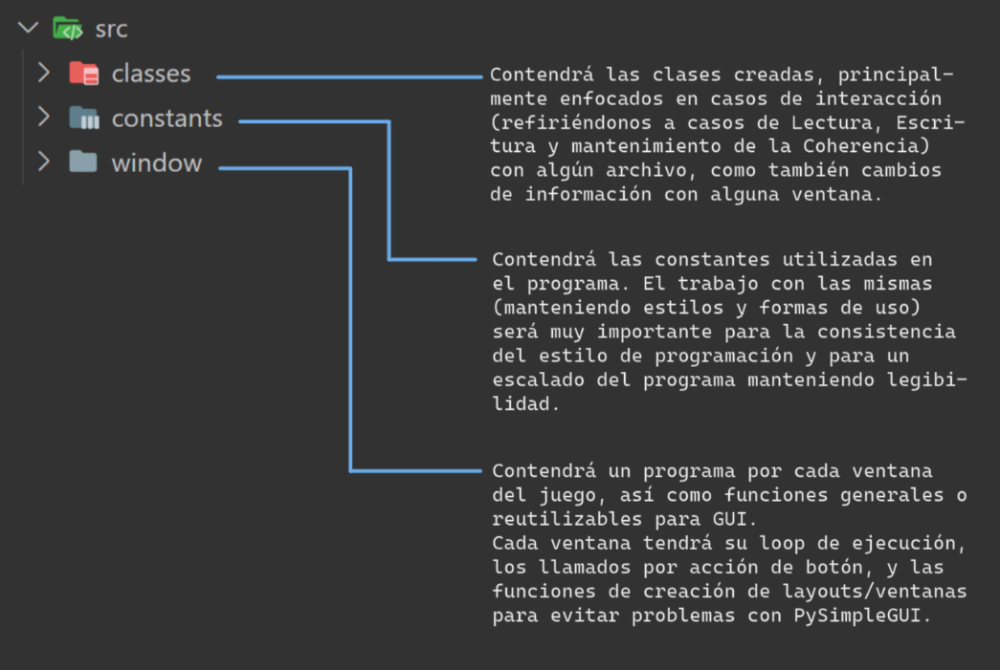

 <h2 style="text-decoration:none">Informe Final</h2> 

 <h3 style="text-decoration:none">Seminario de Lenguejes - Python</h3> 

 <h3 style="text-decoration:none">Grupo 14</h3> 

 

_Nicolás Bonoris,_ 
_Ulises Geymonat,_ 
_Ignacio Mariano,_ 
_Enzo Francisco Battista._

 

---
 
En este informe, realizaremos un desarrollo abarcativo acerca del proyecto en general.
 
Haremos una muestra de temas pilares que no tendrán un enfoque a nivel de código, sino que con una mirada a nivel de estructura, describiendo primero el trayecto que fue teniendo el proyecto y sus resultados, para luego aportar las guías necesarias para el uso de este "paquete" (yendo desde la instalación y su uso, hasta su modificación y escalado). 
Las consideraciones de estilos y diseño se mencionarán, ejemplificarán y detallarán repetidamente, ya que este es para nuestras consideraciones un aspecto fuerte del producto.

 

---

## Índice
1. [Marco teórico](#1-marco-teórico)
2. [Problemas y soluciones surgidas durante el desarrollo](#2-problemas-y-soluciones-surgidas-durante-el-desarrollo)
3. [Consideraciones Éticas sobre el Desarrollo](#3-consideraciones-éticas-sobre-el-desarrollo)
4. [Conclusiones y Trabajos Futuros](#4-conclusiones-y-trabajos-futuros)
5. [Guía de Usuario](#5-guía-de-usuario)
6. [Guía para el Desarrollador](#6-guía-para-desarrolladores)

 

---

# 1. Marco Teórico

Para la realización del proyecto, se utilizaron múltiples librerías para conseguir un mejor producto, y para facilitar el desarrollo del mismo.
- Como librería principal para manejar la interfaz del videojuego, se utilizó [PySimpleGUI](https://www.pysimplegui.org "pysimplegui.org"), la cual permite la creación de las diferentes ventanas donde se ejecuta el juego.
- Para trabajar con los diferentes conjuntos de datos, se escogió la librería [Pandas](https://pandas.pydata.org/ "pandas.pydata.org"), la cual simplifica el manejo de datasets,y permitió, no solamente generar todas las estadisticas y graficos que genera el juego a partir de las partidas jugadas, sino que también se utilizo para realizar el funcionamiento principal del juego (elegir las opciones del conjunto de datos, y elegir la respuesta correcta).
- Para la realización de una ambientación musical, se utilizó la librería [PyGame](https://www.pygame.org/docs/ "pygame.org"), especialmente la funcionalidad del mixer, se verá su uso únicamente en la clase Settings.

---

# 2. Problemas y Soluciones surgidas durante el Desarrollo
- **Limitaciones de PySimpleGUI:** No hay diseño responsivo (por las enormes limitaciones de diseño y personalización, habría que utilizar algún resizing de imágenes y elementos, que con el tiempo dado no pudimos corregir), el uso de los tamaños es muy seguramente uno de los primeros factores que corregiríamos si fuese a preguntarnos. Por otra parte, el hecho de que los layouts no sean elementos actualizables nos limitó en gran manera y nos retrasó mucho, ya que no habíamos escuchado de eso antes y tuvimos que investigar hasta encontrar la causa de los errores que se presentaban.
- **Problemas de código repetido:** El código se estaba tornando muy denso y repetitivo, por lo que decidimos reorganizar el enfoque imperativo por módulos, para pasar a un enfoque orientado a objetos, en su momento para las clases player y settings.
- **Separación de las clases:** Fue una de las principales preocupaciones en el enfoque, pasamos por diferentes ideas, y al final lo terminamos por realizar de acuerdo a los archivos con los que cada clase interactuaba, player y settings tuvieron que compartir un mismo módulo (por errores de importación circular, cuyas dependencias causantes fueron resueltas pudiendo separarlos); estas también terminaron por ser completamente estáticas, ya que debido al uso de los datos la instanciación de objetos era completamente prescindible (y hasta contraproducente, por dificultades en comunicación). Con la clase Match también hubieron muchas ideas descartadas, las cuales culminaron en la creación de una cuarta clase "controladora" (InGameEvents).
- **Problemas en el uso manual de archivos:** Otra de nuestras principales motivaciones fue en torno al uso seguro del programa (sin rupturas) a pesar de la manipulación manual de los archivos. Los efectos ante el borrado y/o modificación (con posibles rupturas de las correspondencias entre los datos) de los archivos de datos (para partidas, configuraciones y perfiles) se intentan mitigar de forma constante, evitando el corte de ejecución del programa; de todas formas, no se recomienda la manipulación manual de los mismos bajo ningún término.  

 

---

# 3. Consideraciones Éticas sobre el Desarrollo
- Por cuestiones de tiempo no pudimos agregar funciones de accesibilidad, nos hubiera gustado tener un modo de contraste alto, un cambio dinámico de tamaño de fuente y selección de idiomas (por lo menos Español/Inglés). En estos aspectos, pudimos avanzar un poco llegando ya al final, poniendo temas diferentes (donde se puede elegir el que menos canse la vista/ mayor contraste genere/ más guste) y preparando el uso de estilos globales.
- Todo lo utilizado es propio o libre, y la licencia del proyecto es libre.
- La elección de género en las instancias de creación y modificación de perfil permitan a cada uno ingresar ña opción que prefiera, no hay ninguna restriccción ante tipos específicos predefinidos.
- Una mayor compatibilidad con grandes variedades de dispositivos (ya sea en torno a Software o Hardware) hubiera sido un fin ideal, hasta lo que pudimos llegar fue a incluir soporte para Windows y Linux, facilitando el troubleshooting mediante la impresión de advertencias en consola e incluyendo un archivo "requirements.txt" con las dependencias del "paquete". 

 

---

# 4. Conclusiones y trabajos futuros
- Lo aprendido es completísimo, el mayor valor que le sacamos es para la creación de un proyecto de software, trabajo en grupo para la creación de un proyecto, introduce mucho al mundo práctico de esta carrera. Esto se ve mucho en el uso de git y los repositorios en GitLab.
- Aprendimos muchísimo sobre creación de proyectos de software, en lo que nuestra experiencia era casi nula:
    - Creación de estructuras de directorios.
    - Compatibilidad entre diferentes OS (por las siglas en inglés de Sistemas Operativos) por medio de direcciones relativas y uso de ambientes y máquinas virtuales.
    - Uso coherente y seguro de los datos.
    - Uso coherente de múltiples módulos con importaciones.
    - Uso de librerías.
Son sólo algunas de los tantos temas en los que tuvimos una excelente primera experiencia con este proyecto.
- PySimpleGUI es una librería con altísimas limitaciones si se busca hacer un diseño estético; el uso de imágenes y tamaños genera muchísimas complicaciones. El uso de tal vez otra librería, o tal vez una guía que presente más a detalle estas limitaciones desde antes de comenzar el proyecto hubiera sido muy útil. De todas formas, creemos que hasta estas limitaciones plantean ventajas, ya que adaptarse a ellas e investigar para encontrar soluciones es una de las mejores maneras de aprender (además de ser esta habilidad, la de solucionar problemas con las herramientas disponibles, indispensable para el desarrollo de un perfil profesional). Ni se mencionan las utilidades de haber tenido un primer contacto con una GUI (por las siglas en inglés de Interfaz de Usuario Gráfica).

 

---

# 5. Guía de Usuario
Acá podrían incluir capturas de pantalla de la aplicación, con una guía de cómo se opera.
La Figura 1 muestra una captura de la pantalla inicial del juego…..

Figura 1. Captura de…..

- Descarga, guía de instalación, instalación de dependencias con requirements y qué ejecutar.
- Advertencia recomendando no tocar archivos.
- Capturas de estilo “how to play”, explicando la interfaz, y cada recomendación (juejo, configuración, perfiles, scores, …).

 

---

# 6. Guía para Desarrolladores
Comenzando por la estructura de directorios, tendremos una estructura como se muestra en la imagen:

Todos los archivos de Lectura/Escritura se ubicarán en “data”, para el acceso a un archivo se recomienda añadir su dirección como una constante en “src > constants > directions”, se recomienda seguir con el orden por subdirectorios, para facilitar la ubicación de cada archivo (una buena práctica sería por ejemplo separar las imágenes por uso, como se vino haciendo hasta el release v3.0 - o “tercer entrega”, como prefieren decirle algunos).
Para el agregado de programas que no sean utilizados en la ejecución del juego y que utilicen los datos (ya sea en forma de lectura o escritura), se hará dentro del directorio “data_management”.
El código del programa se alojará en “src”, la estructura dentro del mismo está también definida, para un mayor orden:

El funcionamiento se basará en 3 sectores principales: **datos**, **clases** y **ventanas**. La interacción entre estos 3 irá definiendo toda la estructura; clases y ventanas consultarán constantemente las constantes del proyecto y el contenido de lectura de “data”.

La _interacción con los archivos volátiles_ (“matches” con los datos de partidas, “users” con los datos de los usuarios, “loaded_nicks” con todos los nicks en uso y correspondencia de acceso con usuarios en “users”, y “cached_settings”) será principalmente (si no de forma exclusiva) por medio de las **clases**, que _a su vez interactuarán con cada ventana_, y estas con el usuario.
 
Las **ventanas** _interactuarán con el usuario y las clases_. Se busca que cada ventana esté contenida en un programa dedicado, el cual tendrá la función creadora del layout, la función creadora de la ventana y el loop de ejecución de la misma, además de cualquier función que se quiera, si es esta exclusiva de esta ventana. En la carpeta window podremos ubicar otras funciones si son exclusivamente para uso de GUI (un ejemplo es “card_creation.py”, con funcionalidades para la creación de botones y tarjetas en la ventana de juego).
 
Para el escalado eficiente del programa, cualquier agregado en estilos o direcciones deberá verse reflejado en **constants**, que contendrá todas las _constantes del programa_.

---

Explicar cada ventana se considera innecesario, conociendo la estructura que acaba de mencionarse y el recorrido mencionado en la guía de usuario debería ser más que suficiente. Con las clases, consideramos útil una explicación en profundidad, por lo que procederemos a explicar cada una:

### Match
La instancia de esta clase va a controlar una partida de una forma que consideramos de “bajo nivel”, desde interacción con los archivos hasta el guardado de los datos de la misma. Creará y guardará los eventos en una lista temporal que contendrá un conjunto de los mismos, para luego ante la finalización de la partida guardarlos (si esto es lo que se pide) en el archivo “matches.csv”. Obtiene de “Settings” los datos actuales de configuración, y escribirá en “matches.csv”.

### InGameEvents
Al crear una instancia (que recibirá una referencia para el objeto “Match” referente a la partida en curso, y otra para la ventana siendo usada actualmente), controlaremos la comunicación entre el objeto de la partida y la ventana. Contiene funciones específicas para cada evento producido desde la ventana (como tiempo acabado, respuesta acertada, partida abandonada, etc.), y para la modificación de la ventana en uso (para la actualización en botones y tarjetas de una forma mucho más legible y eficiente). Será un nexo entre la ventana de juego y la instancia de la partida actual.

### Settings
Será completamente estática, no instanciable (al igual que la clase “Player”, por temas de eficiencia y simplicidad, ya que así se cumple mejor con el fin y se descartan errores). Contendrá información sobre la configuración actual de la partida, obteniendo los datos de la ejecución más reciente de “cached_settings.json”, y actualizando el mismo al cerrarse la ventana de menú, preparando los datos para la próxima ejecución.

### Player
Será completamente estática y controlará los datos de los jugadores, ya sean eliminaciones, modificaciones, creaciones, o manejos de problemas de consistencia. Tendrá disponibles los datos modificables del jugador actual (no el nick ni los datos de partidas jugadas), y ante cualquier modificación los actualizará.

---

Como último tema importante a tratar, podemos hablar de las consideraciones hacia los posibles errores por modificación manual de los archivos, que fue una de las preocupaciones principales al momento de llevar a cabo las clases (que llevarán toda interacción con los datos). El fin principal en el que nos centramos fue en evitar la ruptura del programa y/o la muestra de información no válida, por lo que ante cualquier inconsistencia en los datos, error en la estructura del archivo, cargado de datos no válidos, fallo por archivo inexistente, etcétera; se creará un nuevo archivo en blanco y se pisará la dirección en la que este debería existir. Esto es una tarea muy compleja, por lo que seguirán habiendo errores en contadas ocasiones, la guía de uso en “README.txt” deberá advertir en contra de esta práctica, y ante cualquier error a causa de esto, recomendar una reinstalación del paquete completo.

